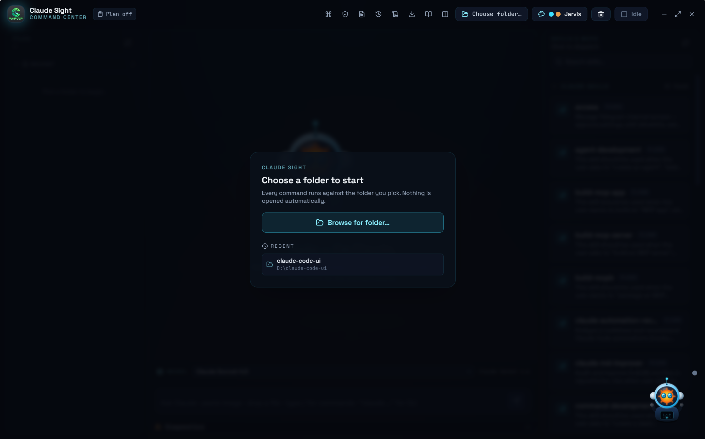
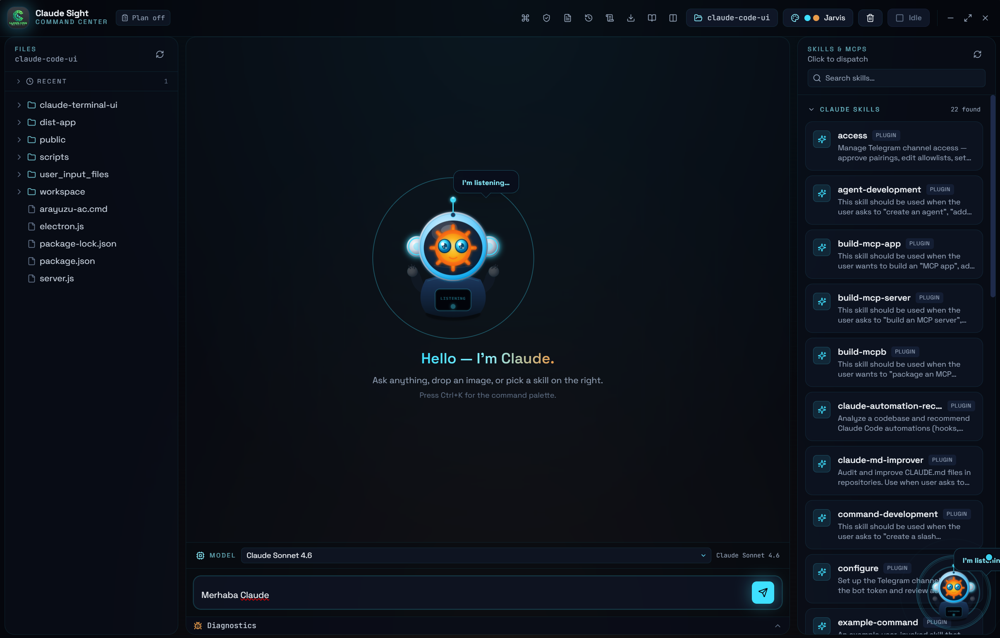
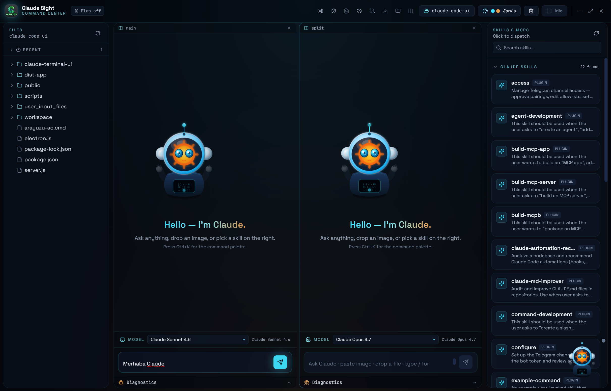
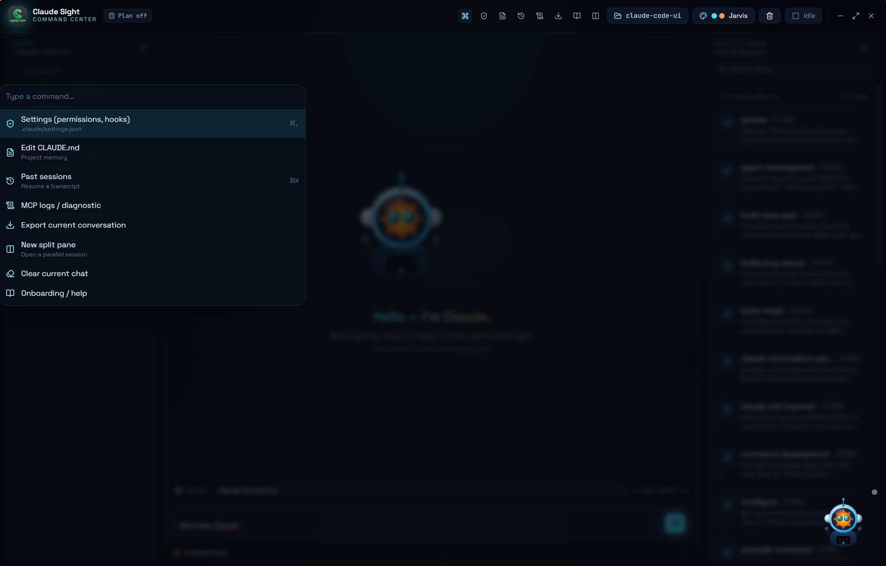
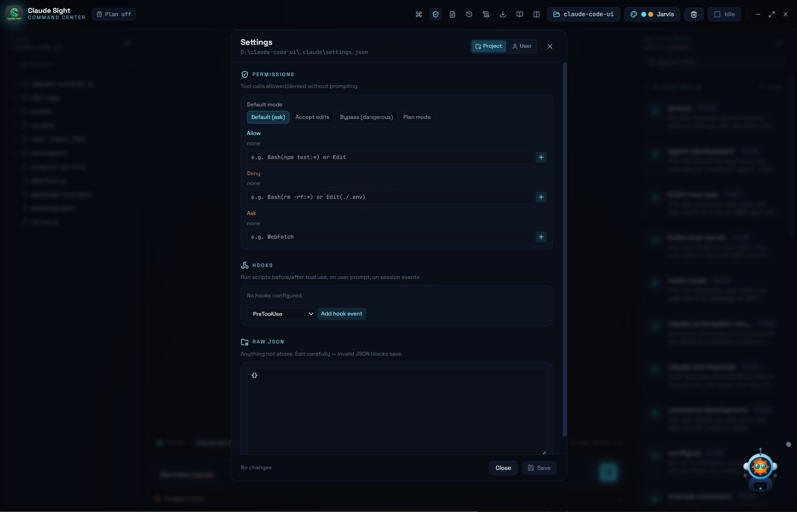

<div align="center">


# Claude Sight

**A visual, animated command center for [Claude Code](https://docs.claude.com/en/docs/claude-code).**

Chat with Claude through a beautiful desktop interface instead of the terminal. Features split panes, a living mascot companion, live file tree, diff review, skills panel, command palette, and MCP server management — all powered by the real `claude` CLI running underneath.

[](LICENSE)
[](https://electronjs.org/)
[](https://react.dev/)

</div>

---

## Table of Contents

- [Overview](#overview)
- [Screenshots](#screenshots)
- [Features](#features)
- [Requirements](#requirements)
- [Installation](#installation)
- [Quick Start](#quick-start)
- [How to Use](#how-to-use)
  - [Onboarding & First Run](#onboarding--first-run)
  - [Chat with Claude](#chat-with-claude)
  - [Split Panes](#split-panes)
  - [Model Selector](#model-selector)
  - [Slash Commands](#slash-commands)
  - [Claude CLI Commands](#claude-cli-commands)
  - [File Tree & Preview](#file-tree--preview)
  - [Skills & MCP Panel](#skills--mcp-panel)
  - [Diff Review (Accept / Reject)](#diff-review-accept--reject)
  - [Plan Mode](#plan-mode)
  - [Floating Companion](#floating-companion)
  - [Command Palette](#command-palette)
  - [Keyboard Shortcuts](#keyboard-shortcuts)
  - [Themes](#themes)
  - [Stop / Abort](#stop--abort)
- [Command Reference](#command-reference)
- [Cross-Platform Support](#cross-platform-support)
- [Project Structure](#project-structure)
- [Troubleshooting](#troubleshooting)
- [Contributing](#contributing)
- [License](#license)

---

## Overview

Claude Sight wraps the official **Claude Code CLI** in a frameless, themeable Electron desktop app. Every message you send spawns a real `claude` process and streams the response back as animated chat bubbles. Nothing is emulated — you get 100% of Claude Code's power (code editing, Bash tool, LSP, skills, MCP servers) through a friendly interface.

**Who is this for?**
- Developers who prefer GUIs over terminals
- Teams that want a consistent Claude interface across Windows, macOS, and Linux
- Anyone who wants to see Claude "work" through a living mascot companion

---

## Screenshots

> Replace the placeholders below with your own screenshots by dropping images into `docs/screenshots/` and updating the paths.

| Welcome Screen | Active Chat | Split Panes |
|:---:|:---:|:---:|
|  |  |  |

| Command Palette | Settings |
|:---:|:---:|
|  |  |

---

## Features

- **Real Claude Code** — Every prompt runs the actual `claude` CLI underneath; all tools (Bash, Edit, Read, LSP, etc.) work exactly as in the terminal.
- **Split Panes** — Open multiple parallel chat sessions side-by-side (`Ctrl+T`). Each pane has its own message history, session ID, and plan mode.
- **Animated Mascot** — A 2.5D SVG Claude bot with three states: *idle* (gentle floating), *listening* (ears open, eyes track), *processing* (star spins, particles orbit).
- **Floating Companion** — Draggable avatar in the bottom-right corner. Reacts to everything Claude does.
- **Diff Review** — When Claude edits a file, see a unified diff inline with **Accept** and **Reject** buttons. Reject can fast-revert locally or ask Claude to undo.
- **Plan Mode** — Toggle plan mode (`Ctrl+/`) so Claude presents a plan and waits for your approval before making changes.
- **Command Palette** — `Ctrl+K` to instantly jump to any panel, action, or command.
- **File Tree** — Browse your project live. Right-click for context menu (Explain, Refactor, Add tests, Copy path). Click any file for syntax-highlighted preview.
- **Skills Panel** — Discover and dispatch SKILL.md skills, quick actions, and MCP servers from the sidebar.
- **Settings Editor** — GUI for `.claude/settings.json` — permissions (allow/deny/ask), hooks, and raw JSON editing.
- **Sessions Browser** — Resume past conversations from `~/.claude/projects`.
- **CLAUDE.md Editor** — Edit project memory inline.
- **MCP Logs** — View per-server MCP logs for debugging.
- **Export** — Save any conversation as Markdown, JSON, or plain text.
- **Diagnostics Drawer** — Real-time stderr, raw events, and info logs from the CLI.
- **Image Support** — Paste images from clipboard or drag-and-drop into the input bar.
- **Git Status** — Live branch / dirty / ahead-behind badge in the top bar. Click to review staged changes.
- **Cost Tracking** — Live cost, token, and turn counter for the active session.
- **Model Selector** — Switch between Opus 4.7, Opus 4.6, and Sonnet 4.6 on the fly.
- **Slash Commands** — Autocomplete for common shortcuts (`/explain`, `/test`, `/fix`, etc.).
- **Raw CLI Passthrough** — Type any command starting with `claude ` (e.g., `claude mcp add`) to run it directly.
- **Keyboard Shortcuts** — Power-user hotkeys for every major action.
- **Three Themes** — Jarvis (neon cyan/ink), Blossom (pink/plum), macOS (light SF-style).
- **Session Persistence** — Conversations resume automatically via Claude's built-in session IDs.
- **Frameless Window** — Custom window controls with native-feeling drag regions.

---

## Requirements

1. **Node.js 22+** (Node 24 has a known Electron bug on Windows; stick to 22.x for now)
2. **Claude Code CLI** installed and on your `PATH`:
   ```bash
   claude --version
   ```
   If it's installed elsewhere, set `CLAUDE_BIN=/full/path/to/claude` before launching.
3. **Logged in** to Claude Code:
   ```bash
   claude login
   ```

### Platform Notes

| OS | Notes |
|---|---|
| **Windows** | Requires `claude.cmd` on PATH. Uses `cross-spawn` internally to avoid Node 20.12+ `EINVAL` spawn bugs. |
| **macOS** | Works out of the box. `claude` binary should be in `/usr/local/bin` or `~/.local/bin`. |
| **Linux** | Works out of the box. Make sure `claude` is executable and on PATH. |

---

## Installation

```bash
# Clone the repo
git clone https://github.com/skaterzeal/claude-sight.git
cd claude-sight

# Install dependencies
npm install
```

### Optional: PTY Terminal Mode

The chat UI works **without** `node-pty`. If you want a raw PTY terminal tab inside the app:

```bash
npm install --save-optional node-pty
npx electron-rebuild -f -w node-pty
```

This requires Python + a C++ toolchain (VS Build Tools on Windows, Xcode CLT on macOS, `build-essential` on Linux).

---

## Quick Start

### Development Mode (hot reload)

```bash
npm run dev
```

This starts Vite on `localhost:5173` and launches Electron in a detached DevTools window.

### Production Build (local run)

```bash
npm run build
npm start
```

### Package Installers

```bash
npm run package
```

Creates platform-specific installers via `electron-builder`:
- **Windows** → `release/Claude Sight Setup.exe` (NSIS)
- **macOS** → `release/Claude Sight.dmg`
- **Linux** → `release/Claude Sight.AppImage`

---

## How to Use

### Onboarding & First Run

The first time you launch Claude Sight, an onboarding modal checks that the `claude` CLI is on your PATH and helps you pick a project folder. You can reopen it anytime from the top bar or with `Ctrl+K` → **Onboarding / help**.

Recent projects are remembered and shown in the launch picker for quick access.

---

### Chat with Claude

Type anything into the input bar at the bottom and press **Enter** (or click the send button). Claude Sight spawns `claude -p "your prompt" --output-format stream-json` and streams the response as chat bubbles.

**Multi-line messages:** Press `Shift + Enter` to add a new line.

**Attach images:** Paste from clipboard (`Ctrl+V`) or drag & drop an image into the input bar. You can also drop a file to insert its path as `@/path/to/file`.

**Redirect:** If Claude is going off track while a response is streaming, click the **↷ Redirect** button (wind icon) to send a follow-up in the same session.

**Auto-scroll:** The chat scrolls automatically as new content arrives.

---

### Split Panes

Press `Ctrl+T` (or click the split button in the top bar) to open a new pane side-by-side. Each pane is independent:
- Own message history
- Own session ID (resumable)
- Own plan mode toggle
- Can be closed with the × button

Click a pane to activate it (active pane gets a cyan ring). Cost tracking and plan mode always apply to the **active pane**.

---

### Model Selector

Above the input bar, a dropdown lets you pick the model:

| Model | Dropdown Label |
|---|---|
| `claude-opus-4-7` | **Claude Opus 4.7** (default) |
| `claude-opus-4-6` | **Claude Opus 4.6** |
| `claude-sonnet-4-6` | **Claude Sonnet 4.6** |

Your choice is saved to `projectRoot/.claude.json` and injected into every subsequent CLI spawn as `--model <choice>`.

---

### Slash Commands

Type `/` in the input bar to see autocomplete suggestions:

| Command | What it does |
|---|---|
| `/explain` | Explain the selected code or current file |
| `/fix` | Fix bugs or errors in the current file |
| `/test` | Run the project's test suite |
| `/commit` | Generate a git commit message |
| `/refactor` | Refactor the selected code |

Press **Tab** to auto-fill the first suggestion.

---

### Claude CLI Commands

Any input that starts with `claude ` (note the space) is sent **raw** to the CLI instead of being wrapped in `-p`. This lets you run any Claude Code subcommand directly:

```text
claude mcp add everything-claude https://github.com/affaan-m/everything-claude-code
claude mcp list
claude mcp remove everything-claude
claude config set model claude-opus-4-6
```

The output streams back as a system message bubble.

**Important:** For `mcp add`, the format is:
```text
claude mcp add <name> <command-or-url>
```

---

### File Tree & Preview

- **Left sidebar** shows the directory tree of the selected project root.
- **Click a file** → it opens in a syntax-highlighted preview in the main panel.
- **Right-click a file** → context menu with: Explain, Refactor, Add tests, Use as context, Copy path.
- **Click the ×** (or the project folder button in the top bar) to return to chat.
- **Double-click a folder** → expands/collapses it.

The file tree refreshes automatically when the project root changes.

---

### Skills & MCP Panel

The **right sidebar** has three collapsible sections:

#### 1. Claude Skills
Scans for `SKILL.md` files in:
- `<projectRoot>/.claude/skills/<name>/SKILL.md`
- `<home>/.claude/skills/<name>/SKILL.md`
- Plugin directories (`%APPDATA%/Claude` on Windows, `~/.config/Claude` on Linux, `~/Library/Application Support/Claude` on macOS)

Each discovered skill shows its name, description, and source badge (`project`, `user`, or `plugin`). **Click a skill** to dispatch:
```text
Use the "<skill-name>" skill. Help me apply it to this project.
```

#### 2. Quick Actions
Six one-click shortcut prompts:
- **Explain project** — Overview of architecture and entry points
- **Find TODOs** — Scan for TODO/FIXME/HACK comments
- **Run tests** — Auto-detect test runner and execute
- **Review diff** — Review staged git changes
- **Audit deps** — Find outdated or risky packages
- **Draft README** — Generate a README.md

#### 3. MCP Servers
Lists every MCP server registered with `claude mcp list`. **Click a server** to prompt Claude to use it.

---

### Diff Review (Accept / Reject)

When Claude uses the **Edit**, **Write**, or **MultiEdit** tool, a inline diff card appears in the chat bubble:

- **Accept** ✅ — Confirms the change (already applied by Claude).
- **Reject** ❌ — Two options:
  1. **Fast local revert** — If the file is inside the project and the old text is known, it is restored instantly without calling Claude again.
  2. **Ask Claude to revert** — Sends a "revert that change" prompt in the same session as a fallback.

---

### Plan Mode

Toggle **Plan mode** from the top bar or press `Ctrl+/`. When ON, Claude presents a plan before making any file changes and waits for your approval. Great for dangerous or large refactors.

Plan mode is **per-pane**, so you can have one pane in plan mode and another in normal mode simultaneously.

---

### Floating Companion

The animated Claude mascot lives in the **bottom-right corner** of your screen:

| State | Visual |
|---|---|
| **Idle** | Gentle float, slow blinks, chest screen shows scrolling code symbols |
| **Listening** | Ears brighten and widen, antenna wiggles, sound waves emit, speech bubble says *"I'm listening…"* |
| **Processing** | Star face spins, orbital particles dance, arms type, shockwaves pulse, speech bubble says *"Thinking…"* |

- **Drag** it anywhere on screen.
- **Click** it (without dragging) to focus the chat input.
- **Mouse tracking** — the bot subtly tilts toward your cursor for a 2.5D depth effect.

---

### Command Palette

Press `Ctrl+K` to open the command palette. Search and jump to:
- Settings
- CLAUDE.md editor
- Past sessions
- MCP logs
- Export conversation
- New split pane
- Clear chat
- Onboarding

---

### Keyboard Shortcuts

| Shortcut | Action |
|---|---|
| `Ctrl + K` | Open Command Palette |
| `Ctrl + /` | Toggle Plan Mode (active pane) |
| `Ctrl + L` | Clear current chat |
| `Ctrl + S` or `Ctrl + ,` | Open Settings |
| `Ctrl + M` | Edit CLAUDE.md |
| `Ctrl + H` | Past Sessions |
| `Ctrl + E` | Export conversation |
| `Ctrl + T` | New split pane |
| `Esc` | Close any open panel |
| `Shift + Enter` | New line in input |
| `Tab` | Auto-fill slash command |

---

### Themes

Click the **theme button** in the top bar to cycle through:

| Theme | Style |
|---|---|
| **Jarvis** | Neon cyan + amber on deep ink black (default) |
| **Blossom** | Pink / rose / plum dark mode |
| **macOS** | Light Apple-style with SF-blue accents, opaque cards, softer shadows |

Your choice is saved to `localStorage` and persists across restarts.

---

### Stop / Abort

If Claude is taking too long or heading in the wrong direction, click the **red Abort** button in the top bar. This kills every in-flight child process across **all panes** immediately and marks their bubbles as `stopped`.

---

## Command Reference

| What you type | What happens |
|---|---|
| `How do I refactor this?` | Normal chat prompt. Claude analyzes the project context. |
| `/explain src/App.jsx` | Slash command. Claude explains the file. |
| `claude mcp add myserver npx myserver` | Raw CLI passthrough. Adds an MCP server. |
| `claude mcp list` | Raw CLI passthrough. Lists registered MCP servers. |
| `claude config set theme dark` | Raw CLI passthrough. Sets Claude CLI config. |

---

## Cross-Platform Support

Claude Sight is built to run on **Windows**, **macOS**, and **Linux**:

| Platform | Installer | Notes |
|---|---|---|
| **Windows** | `.exe` (NSIS) | `cross-spawn` handles `.cmd` files safely. Node 22 recommended (Node 24 has an Electron spawn bug on Windows). |
| **macOS** | `.dmg` | Native feel with frameless window. `claude` binary expected on PATH. |
| **Linux** | `.AppImage` | No install required, runs directly. `claude` binary expected on PATH. |

**Optional native dependency:** `node-pty` (for raw PTY terminal mode) requires platform-specific compilation. Install Python + a C++ toolchain, then run `npx electron-rebuild -f -w node-pty`. The app works fully without it.

---

## Project Structure

```
claude-sight/
├── electron/
│   ├── main.cjs          # Main process: IPC, spawn, FS, MCP, git, images, export
│   └── preload.cjs       # contextBridge API exposure
├── src/
│   ├── App.jsx           # Root layout (3-column + split panes + modals)
│   ├── main.jsx          # React entry point
│   ├── index.css         # Tailwind + themes + animations
│   ├── store/
│   │   └── useAppStore.js       # Zustand store (panes, panels, diagnostics)
│   ├── hooks/
│   │   ├── useClaudeStream.js   # NDJSON stream folding into panes
│   │   └── useShortcuts.js      # Global keyboard shortcuts
│   ├── lib/
│   │   ├── streamEvents.js      # stream-json event parsers
│   │   ├── skillRegistry.js     # parseMcpList + built-in actions
│   │   └── slashCommands.js     # slash command detection + autocomplete
│   └── components/
│       ├── TopBar.jsx
│       ├── ChatPanel.jsx
│       ├── ChatBubble.jsx
│       ├── InputBar.jsx
│       ├── ModelSelector.jsx
│       ├── FileTree.jsx
│       ├── FilePreview.jsx
│       ├── FileTreeContextMenu.jsx
│       ├── SkillsPanel.jsx
│       ├── Mascot.jsx
│       ├── FloatingCompanion.jsx
│       ├── ThemeSwitcher.jsx
│       ├── DiffView.jsx
│       ├── CommandPalette.jsx
│       ├── SettingsPanel.jsx
│       ├── SessionsPanel.jsx
│       ├── ClaudeMdPanel.jsx
│       ├── McpLogsPanel.jsx
│       ├── ExportPanel.jsx
│       ├── DiagnosticPanel.jsx
│       ├── Onboarding.jsx
│       ├── GitStatus.jsx
│       ├── CostBadge.jsx
│       ├── PlanModeToggle.jsx
│       └── ActiveSkillChip.jsx
├── public/
│   └── claudelogo.png
├── build/
│   └── icon.png            # App icon for electron-builder
├── docs/
│   └── screenshots/        # README screenshot placeholders
├── package.json
├── vite.config.js
├── tailwind.config.js
├── postcss.config.js
└── index.html
```

---

## Troubleshooting

### "Failed to spawn `claude`"
The `claude` binary isn't on your `PATH`. Either:
- Add it to PATH, **or**
- Launch the app with `CLAUDE_BIN=/full/path/to/claude npm run dev`

### "Nothing streams / bubble stuck on Thinking…"
Test manually in a terminal:
```bash
claude -p "hi" --output-format stream-json --verbose
```
You should see NDJSON lines. If not, update your Claude CLI:
```bash
claude update
```

### Blank / black screen on launch
Open DevTools (`Ctrl+Shift+I`) and check the **Console** for red errors. The most common cause is a Zustand selector that returns a new object reference on every render (e.g., an uncached `selectTotals`). If you see `Maximum update depth exceeded`, the fix is to wrap the calculation in `useMemo` inside the component.

### PTY terminal disabled
`node-pty` is optional. The chat UI works without it. To enable:
```bash
npm install --save-optional node-pty
npx electron-rebuild -f -w node-pty
```

### Windows: spawn EINVAL error
This app uses `cross-spawn` to avoid the Node 20.12+ `EINVAL` bug on Windows. If you still see spawn errors, make sure `claude.cmd` exists and Node is **22.x** (not 24.x).

### Theme doesn't apply to mascot
Make sure your `theme` value in the Zustand store is one of `jarvis`, `pink`, `macos`. The mascot reads this directly to switch between dark/light gradients.

---

## Contributing

Contributions are welcome! This is an open-source project meant to make Claude Code accessible to everyone.

1. Fork the repo
2. Create a feature branch: `git checkout -b feature/amazing-thing`
3. Commit your changes: `git commit -m 'Add amazing thing'`
4. Push to the branch: `git push origin feature/amazing-thing`
5. Open a Pull Request

Please keep changes minimal and focused. See `CLAUDE.md` for the project's coding philosophy.

---

## License

[MIT](LICENSE) © 2026 Karmagen
